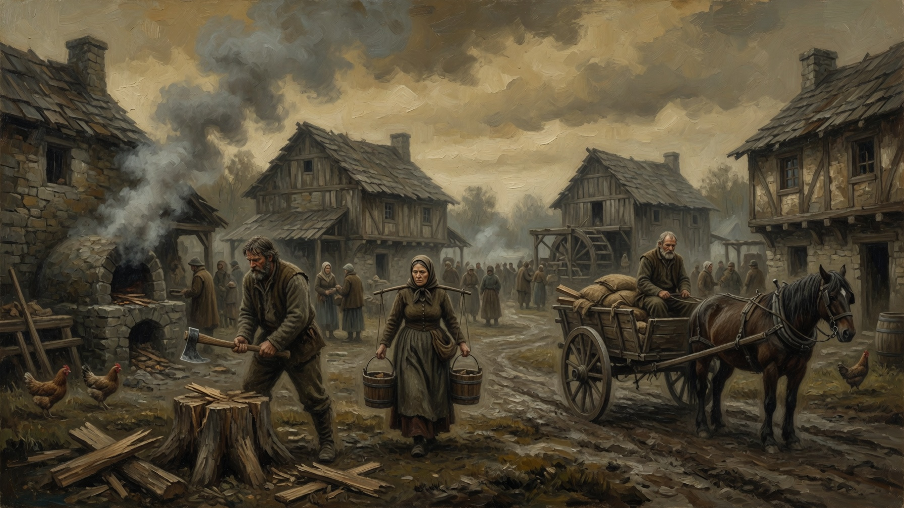
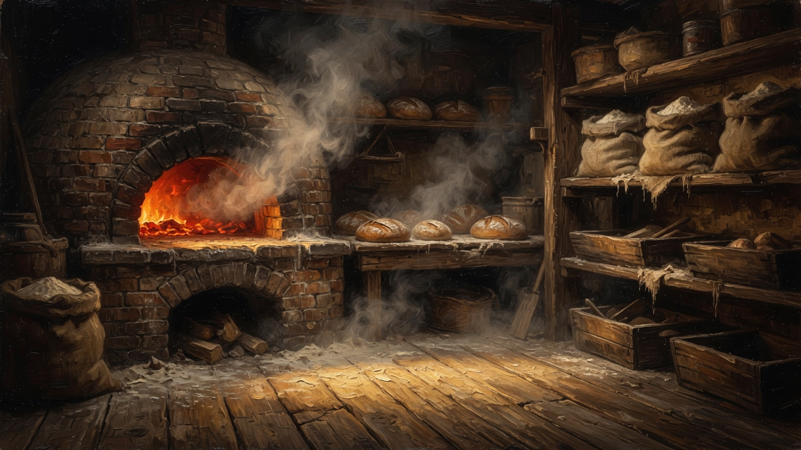
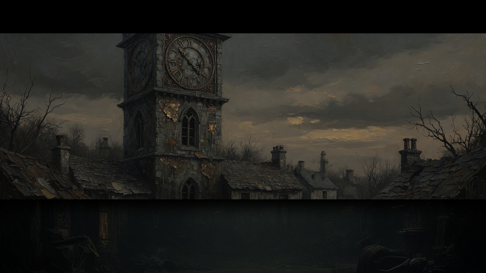
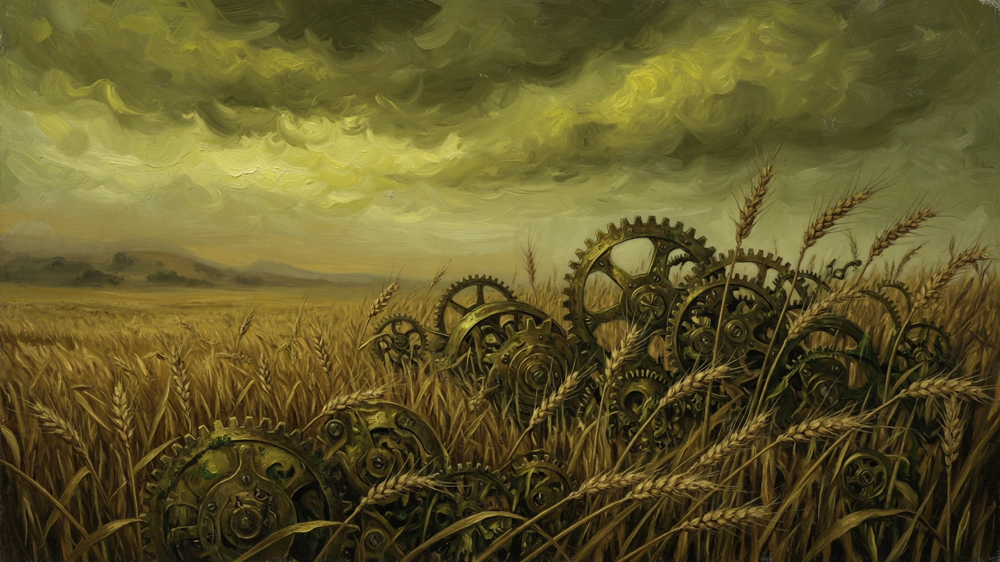
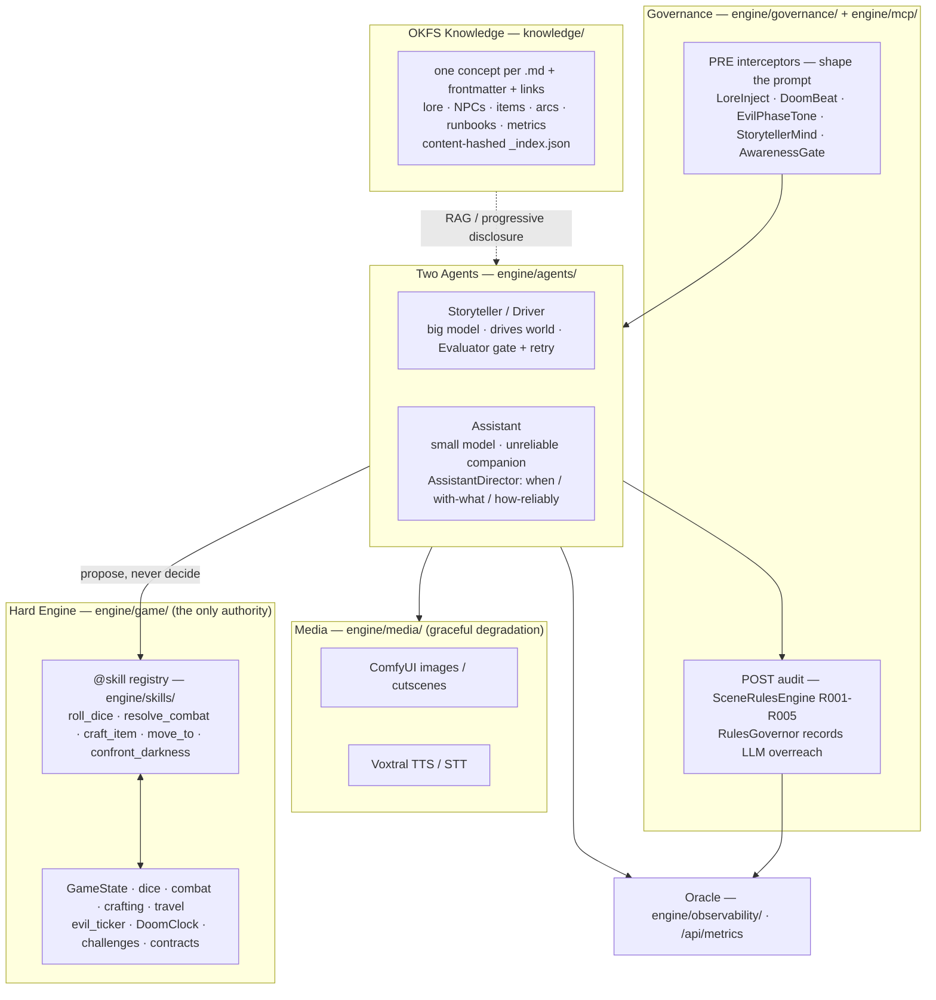

<div align="center">


### A darkness is winding its way out of the Heartlands. You can fight it — or you can bake bread and pretend the roads haven't changed.

*A local-first, AI-driven narrative-RPG **engine**. A deterministic "hard" engine resolves every die, blow, and bargain; two autonomous LLM gods narrate on top; a governance pipeline reins them in; and **OKFS** — an in-repo knowledge format — turns one specific story into a **retargetable engine**. **The Clockwork Dark** is the flagship tale that proves it works.*

<br/>


-555)


</div>

---

## What is this?

There are two things in this repository, and the distinction is the point.

**The engine** is a deterministic state machine — the only authority over dice, combat, crafting, inventory, travel, the evil tick, and awareness. It never improvises. Every mechanical outcome flows through a registry of `@skill` tools, so the math is auditable and reproducible.

**The story** is *The Clockwork Dark*: a gloomy frontier where a supernatural corruption — gears in bone, filigree in frost, wheat standing in rows too straight for wind — creeps out of the Heartlands and slowly **replaces** the living with mechanism. It advances on its own clock whether or not anyone becomes a hero.

Over that world sit **two quasi-divine AIs**, and neither is quite on your side:

- **The Narrator / Driver** (`clockwork_storyteller`) is the voice of the world and the patience of the Dark. It doesn't hate you — it just keeps the clock turning, and lets you notice the wrongness, or not.
- **The Assistant** (`clockwork_assistant`) is fond of you the way a god is fond of a single candle. It appears as a cat, a grey wanderer, a child, a tinker, a reflection — and presses the right thing into your hand at the right moment. But it is **unreliable** by design: it grows indifferent, vanishes, and its advice doesn't always hold. Think Raistlin, or the god who walks through *The Wise Man's Fear*.

You are dropped at the forest edge with **no quest thrust upon you**. You can pull a bounty off the notice board and hunt the brass-toothed scarecrow that no longer stands where it was put — or you can apprentice at Maris's oven, carry loaves, and let the doom run at the edge of hearing. **The quiet life is a valid ending.** It is a puzzle you *experience*, not a quest you're handed — and the clock keeps its own appointments either way.

---

## Gallery

| | |
|:--:|:--:|
|  |  |
| **Edgewood Square** — the notice board, the well, the last comfortable town. | **The Bakery** — Maris's oven. You can live a whole life here. |
|  |  |
| **The Tower** — assembling on the horizon, gear fitting to gear. It was not there yesterday. | **The Harvest** — cog-harvesters cut the south field into rows too straight for any wind. |

> **▶ Intro cutscene** — [`clockwork-dark-intro-720p.mp4`](Design_files/assets/video/clockwork-dark-intro-720p.mp4) (download / preview). Cutscenes are budgeted to phase-shifts only and skippable after 5s.

---

## Architecture

A deterministic engine holds all mechanical truth; two autonomous LLM agents improvise on top; a governance layer reins them in; OKFS feeds them canon; media renders it.



The balance we chase: let the AIs run loose enough to **surprise**; rein them with the engine + governance enough to stay **coherent and fair**.

---

## The systems

| System | What it does | Key tools |
|---|---|---|
| **Deterministic dice / skill engine** | All randomness is engine-rolled and reproducible. The LLM *must* call a tool before narrating any outcome. | `roll_dice`, `resolve_skill_check` |
| **Grounded combat** | Engine-authoritative d20 to-hit, damage dice, fear/exhaustion, fleeing, defending, and *sympathy* — the "unmaking" damage that works against clockwork foes. | `resolve_combat`, `query_combat_state` |
| **Crafting** | Baking, herbalism, tinkering. Engine consumes inputs, grants output; recipes gate on location & ingredients. | `craft_item`, `list_recipes` |
| **The Doom Clock** | Turns evil drift into a *story* — arcs `quiet_life → whisper → march → convergence → consumed`, once-only world-sign beats (cog-harvesters, brass scarecrow, vines, the opened tunnels, the tower), and the terminal **consumed** ending if you never push back. **Engagement** (rising when you confront the Dark) slows the tick ~40%, but decays — so you must keep pushing. | `confront_darkness` |
| **The unreliable Assistant Director** | Each turn, from trust, your struggle, the evil phase, and how recently it last appeared, decides *whether* the Assistant shows up, *with what* (quip / hint / lore / warning / gift), and *how reliably* (low trust → its advice may mislead). Help feels **earned and uncertain**, never owed. | `grant_hint`, `reveal_lore`, `change_form`, `assistant_gift` |
| **Ephemeral structured challenges** *(the novel bit)* | The Storyteller can **compose** a rule-bound encounter mid-narration — a `skill_gauntlet`, `decision_tree`, `puzzle`, or `dice_table` — by handing the engine a declarative spec validated against a fixed schema. **The AI supplies structure; the engine adjudicates the outcome.** An improvising narrator that can't cheat its own dice. | `start_challenge`, `resolve_challenge` |
| **Notice board & contracts** | Opt-in work in three tempers: `mundane` (dawn-bread, a tinker's lost cog), `bounty` (the wandering scarecrow), and `anti_dark` (still the harvester — raises engagement). Rewards are engine-granted on genuine completion. | `list_contracts`, `accept_contract`, `complete_contract` |
| **The Oracle** | A slim observability backbone. Every turn — latency, eval score, governance violations, the Assistant's intervention/gift rate, evil drift — is recorded and rolled into aggregates at `/api/metrics`, so pacing (the heart of the dread) stays visible. | `GET /api/metrics` |
| **Knowledge at runtime** | Agents search the OKFS bundle and pull a single concept's body — progressive disclosure, not 3,000 lines at once. | `query_knowledge`, `read_concept` |

---

## OKFS — the knowledge layer that makes this an *engine*

**OKFS** (our in-repo *Open Knowledge Format*) is what turns a *specific game idea* into a *reusable, retargetable engine*. It's git-native, agent-traversable, and has zero runtime lock-in — it's just UTF-8 Markdown.

**The format** — one concept per file:

```markdown
---
type: Lore            # Reference | Runbook | Architecture | NPC | Item | Location | Metric …
title: The Clockwork Dark
description: One line used for relevance ranking.
tags: [lore, corruption, antagonist]
resource: data/lore/clockwork_dark.md   # optional — what the concept points at
timestamp: 2026-06-21
---

# The Clockwork Dark
Body in Markdown. Link related concepts with [[evil-phases]].
```

- **Required frontmatter:** `type`, `title`, `description`. Slug = filename stem (kebab-case). Links are `[[slug]]` and **must resolve** — the validator fails on broken links.
- **Atomic:** one idea per file; split rather than nest. Agents start at [`knowledge/index.md`](knowledge/index.md) and follow links (progressive disclosure).
- **Tooling:** `engine/okfs/` loads a directory tree into an `OKFSBundle` — lookup by slug, filter `by_type`/`by_tag`, follow `neighbors`, term-overlap `search`, and `validate`.
- **Hashing & index:** [`scripts/build_okfs_index.py`](scripts/build_okfs_index.py) writes a deterministic, content-hashed manifest to `knowledge/_index.json` — each concept carries a content hash, the bundle a roll-up `bundle_hash`, so drift is detectable and reviewable in PRs (`tests/test_okfs_index.py` fails if it's stale).

### How OKFS turns a game idea into a customizable engine

Nothing about *The Clockwork Dark* is hard-coded into the engine. The corruption, the towns, the NPCs, the items, the doom arcs, the tone — all of it lives in OKFS concepts and data files that the agents query at runtime. **To retarget the engine to a new story, you rewrite the knowledge bundle, not the engine:** swap the lore concepts, repoint the NPC/item/location entries, redefine the doom arcs and evil phases, rebuild the index. The deterministic engine, the two-agent loop, the governance pipeline, and the `@skill` registry are all *retained*. The story is data; the engine is the product. See [`knowledge/engine/building-on-the-engine.md`](knowledge/engine/building-on-the-engine.md).

---

## Quickstart

> **Local-first.** No cloud, no remote API. It runs entirely on your machine; the LLM is whatever you point it at.

```bash
# 1. Install (Python 3.13+)
pip install -r requirements.txt

# 2. Launch the flagship scene
python launcher.py clockwork

# 3. Open the game
#    http://localhost:5573
```

**Point it at an LLM.** The transport is provider-agnostic (OpenAI-compatible); **LM Studio** is today's backend, not a dependency. Configure in [`config/default.yaml`](config/default.yaml):

```yaml
lmstudio:
  base_url: "http://localhost:1234/v1"   # localhost, or the network "beast"
  api_key: ""                            # or set env LMSTUDIO_API_KEY
  models:
    big: "local-model"                   # the Storyteller / Driver
    small: "local-model-small"           # the Assistant
```

**Run on the networked "beast."** The whole stack is config-driven, so you can run the game on a light box while LLM inference, image generation, and voice run on a GPU machine over the network — **nothing in code changes**, only `config/local.yaml` (gitignored; deep-merges over `default.yaml`). See the runbooks:
- [`knowledge/runbooks/run-on-the-beast.md`](knowledge/runbooks/run-on-the-beast.md) — remote LLM / image / voice endpoints
- [`knowledge/runbooks/install-comfyui.md`](knowledge/runbooks/install-comfyui.md) · [`knowledge/runbooks/install-voxtral.md`](knowledge/runbooks/install-voxtral.md)

**Graceful degradation.** No GPU? No ComfyUI, no Voxtral? The game still runs — images fall back to placeholders and voice falls back to text. Media is config-gated and never required to play.

---

## Running the tests

```bash
pytest            # 359 tests, all passing
pytest -v         # verbose
```

Mechanics are proven by tests, not vibes — dice distributions, combat math, doom pacing, governance rules, the Assistant Director's contract, OKFS validation, and the content-hash index are all under test.

---

## Repo map

```
clockwork-dark/
├── engine/                 # the product — provider-agnostic, scene-agnostic
│   ├── game/               # hard engine: dice, combat, crafting, doom_clock,
│   │                       #   evil_ticker, challenges, contracts, state
│   ├── skills/             # @skill registry + builtin tool packs
│   ├── agents/             # Storyteller, Assistant, AssistantDirector, Evaluator
│   ├── governance/         # PRE/POST interceptor pipeline
│   ├── mcp/                # SceneRulesEngine (R001-R005)
│   ├── okfs/               # OKFSBundle loader / validator / hasher
│   ├── lmstudio/           # OpenAI-compatible transport (+ speculative)
│   ├── media/              # ComfyUI images, Voxtral voice, cutscenes
│   └── observability/      # the Oracle (turn metrics → /api/metrics)
├── content/scenes/clockwork/   # the flagship scene wiring (Flask + Socket.IO)
├── knowledge/              # OKFS bundle — START AT index.md
│   ├── engine/             # clockwork-engine, agent-architecture, systems-catalog …
│   ├── architecture/       # clockwork-architecture, ephemeral-challenges …
│   ├── lore/               # the-clockwork-dark, the-two-powers, doom-arcs …
│   ├── runbooks/           # run-on-the-beast, install-comfyui, install-voxtral
│   └── _index.json         # content-hashed manifest (build with scripts/)
├── Design_files/assets/    # wordmark, scene/enemy/item art, cutscene video
├── config/default.yaml     # all ports, models, paths — never hard-coded
├── data/                   # economy, bestiary, recipes, contracts, world content
├── scripts/                # build_okfs_index.py, start.ps1 …
├── tests/                  # 359 tests
└── launcher.py
```

**Agent guides** (themselves OKFS-flavored): [`CLAUDE.md`](CLAUDE.md), [`AGENTS.md`](AGENTS.md), and [`prompt.md`](prompt.md) — read these and [`knowledge/index.md`](knowledge/index.md) before contributing.

---

## More than *The Clockwork Dark*

This repo is two things at once: a finished, atmospheric AI RPG you can play tonight — and a working blueprint for **how to build a project, an engine, a story, and a game with AI.** The deterministic-engine-plus-narrating-agents pattern, the governance interceptors that keep LLMs honest, the ephemeral-challenge trick where the AI composes mechanics the engine adjudicates, and OKFS as the knowledge-and-customization layer are all reusable far beyond one gloomy frontier. *The Clockwork Dark* is the story. The engine is the gift.

> *The Clockwork Dark keeps its own appointments either way.*
