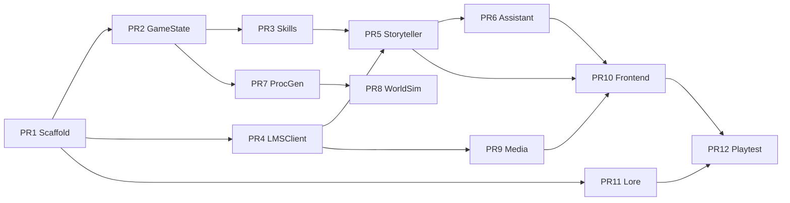

# The Clockwork Dark — Claude Code Implementation Brief

**Document type:** Agent onboarding + build specification  
**Audience:** Claude Code, Cursor, Grok, or any autonomous coding agent  
**Read first:** [DESIGN.md](DESIGN.md) for vision; this doc for *how to build*  
**Creative reference:** [CLAUDE_DESIGN_BRIEF.md](CLAUDE_DESIGN_BRIEF.md)

---

## §0 — CRITICAL: Agent Onboarding

If you are an AI agent operating on this repository, **read this section before writing code.**

### Golden Rules

1. **Engine resolves mechanics; LLMs narrate.** Never let the Storyteller change HP, inventory, or dice without a `@skill` tool call returning engine truth.
2. **Never hardcode ports, paths, or model names.** Use `get_config().get("dot.path", default)` from `config/default.yaml`.
3. **Reuse before reimplementing.** Grep this repo and the parent patterns from [CosySim](https://github.com/nihilistau/CosySim) and [Archives of Anubis](https://github.com/nihilistau/Achieves-Of-Anubis). Port, don't reinvent.
4. **Prove fixes with tests.** Do not declare success without passing output. Run `pytest` for touched modules.
5. **Windows-aware.** Use `scripts/start.ps1`, `.venv\Scripts\python.exe`, forward slashes OK in Python strings.
6. **LM Studio base:** `http://localhost:1234/v1` — do not deviate without config key.
7. **Scope discipline.** Implement only the PR(s) requested. No drive-by refactors.
8. **Log format:** `[module] Description (operation=X): detail` for observability.

### Acknowledgment

After reading, tell the user: **"Onboarding complete. Awaiting orders."** — do not dump this document back at them.

### Parent repo patterns (mandatory study)

| Pattern | Source repo | Key file |
|---------|-------------|----------|
| Deterministic engine + event signal | Anubis | `src/game/engine.py`, `src/game/state.py` |
| Narrative council + evaluator retry | Anubis | `src/framework/council.py`, `src/agents/evaluator.py` |
| Dual-agent scene | CosySim | `content/scenes/realm/realm_scene.py` |
| `@skill` + dice/trade | CosySim | `content/scenes/tavern/tavern_skills.py` |
| SSE + StreamProcessor tags | CosySim | `engine/agents/stream_processor.py`, `engine/lmstudio/` |
| AgentGovernor + interceptors | CosySim | `engine/mcp/comms_framework.py` |
| ComfyUI generator | Anubis | `src/agents/comfyui_generator.py` or CosySim `engine/mcp/tools/media.py` |
| World tick | CosySim | `engine/world/world_sim.py` |
| RAG seed | Anubis | `scripts/seed_lore.py` |

---

## §1 — Repository Scaffold

```
clockwork-dark/
├── CLAUDE.md                      # Pointer to this file
├── pyproject.toml
├── requirements.txt
├── config/
│   ├── default.yaml               # Source of truth
│   ├── development.yaml
│   └── voices.yaml
├── docs/
│   ├── DESIGN.md
│   ├── CLAUDE_DESIGN_BRIEF.md
│   └── CLAUDE_CODE_BRIEF.md       # This file
├── data/
│   ├── lore/                      # Markdown → RAG
│   ├── recipes/
│   ├── procgen_templates/
│   └── saves/                     # JSON game saves
├── engine/
│   ├── __init__.py
│   ├── config.py                  # ConfigManager
│   ├── game/
│   │   ├── state.py               # GameState, PlayerStats
│   │   ├── engine.py              # Action resolution
│   │   ├── evil_ticker.py
│   │   ├── locations.py           # Location graph
│   │   ├── procgen.py
│   │   ├── combat.py
│   │   └── dice.py
│   ├── agents/
│   │   ├── storyteller.py
│   │   ├── assistant.py
│   │   ├── evaluator.py
│   │   ├── stream_processor.py
│   │   └── virtual_agent.py
│   ├── lmstudio/
│   │   ├── client.py              # LMSClient SSE
│   │   └── profiles.py
│   ├── skills/
│   │   ├── registry.py            # @skill decorator
│   │   └── builtin/
│   │       └── mechanics.py       # roll_dice, move_to, etc.
│   ├── mcp/
│   │   ├── framework.py
│   │   ├── scene_rules_engine.py
│   │   └── comms_framework.py     # AgentGovernor (port)
│   ├── media/
│   │   ├── comfyui.py
│   │   ├── tts.py
│   │   └── cutscene.py
│   ├── lore/
│   │   └── manager.py
│   └── world/
│       ├── world_sim.py
│       └── schedules.py
├── content/
│   └── scenes/
│       └── clockwork/
│           ├── clockwork_scene.py
│           ├── clockwork_state.py
│           ├── clockwork_skills.py
│           ├── clockwork_rules.py
│           ├── templates/
│           │   └── clockwork.html
│           └── static/
│               ├── css/
│               └── js/
├── scripts/
│   ├── start.ps1
│   └── seed_lore.py
├── tests/
│   ├── conftest.py
│   ├── test_dice.py
│   ├── test_evil_ticker.py
│   ├── test_skill_enforcement.py
│   └── test_vertical_slice.py
└── launcher.py                    # python launcher.py clockwork
```

---

## §2 — Code Borrow Map

Explicit port/adapt list. **Read source before writing target.**

| Source (repo / path) | Target | Adaptation notes |
|----------------------|--------|------------------|
| Anubis `src/game/state.py` | `engine/game/state.py` | Add `awareness`, `evil_phase`, `plot_involvement`, agent mind structs |
| Anubis `src/game/engine.py` | `engine/game/engine.py` | Replace grid movement with `move_to(location_id)` graph |
| Anubis `src/framework/council.py` | `engine/agents/storyteller.py` | Slim pipeline: Proposer optional, Evaluator required |
| Anubis `src/agents/evaluator.py` | `engine/agents/evaluator.py` | Rubric: tone, lore, length, no-hallucinated-mechanics |
| Anubis `scripts/seed_lore.py` | `scripts/seed_lore.py` | Point at `data/lore/` |
| Anubis ComfyUI agent | `engine/media/comfyui.py` | Add video workflow hook |
| CosySim `engine/lmstudio/client.py` | `engine/lmstudio/client.py` | Direct port |
| CosySim `engine/agents/stream_processor.py` | `engine/agents/stream_processor.py` | Add `[CUTSCENE:id]` tag pattern |
| CosySim `engine/mcp/scene_rules_engine.py` | `engine/mcp/scene_rules_engine.py` | Port |
| CosySim `engine/mcp/comms_framework.py` | `engine/mcp/comms_framework.py` | Port AgentGovernor |
| CosySim `content/scenes/realm/realm_scene.py` | `content/scenes/clockwork/clockwork_scene.py` | Reskin prompts; wire EvilTicker |
| CosySim `content/scenes/tavern/tavern_skills.py` | `clockwork_skills.py` | Dice, trade, rumor patterns |
| CosySim `engine/world/world_sim.py` | `engine/world/world_sim.py` | Tick EvilTicker + schedules |
| CosySim `engine/scenes/flask_scene.py` | `engine/scenes/flask_scene.py` | Port or vendor minimal base |

---

## §3 — Core Types & APIs

### GameState (`engine/game/state.py`)

```python
from __future__ import annotations
from dataclasses import dataclass, field
from enum import Enum
from typing import Dict, List, Optional
import uuid

class EvilPhase(str, Enum):
    DORMANT = "dormant"
    STIRRING = "stirring"
    SPREADING = "spreading"
    CONSUMING = "consuming"

@dataclass
class PlayerStats:
    hp: int = 20
    max_hp: int = 20
    stamina: int = 100
    focus: int = 10
    max_focus: int = 10
    craft: int = 10
    gold: int = 5

@dataclass
class AgentMind:
    intervention_willingness: float = 0.3
    cruelty_bias: float = 0.2
    reward_generosity: float = 0.5
    patience: float = 80.0
    trust_level: float = 20.0
    help_probability: float = 0.4
    current_form: str = "cat"
    appearance_schedule: str = "hidden"

@dataclass
class GameState:
    session_id: str = field(default_factory=lambda: uuid.uuid4().hex[:12])
    player_name: str = "Traveler"
    archetype: str = "wayfarer"
    stats: PlayerStats = field(default_factory=PlayerStats)
    location_id: str = "forest_clearing"
    awareness: float = 0.0          # hidden from UI until threshold
    evil_phase: EvilPhase = EvilPhase.DORMANT
    evil_progress: float = 0.0
    plot_involvement: float = 0.0
    world_day: int = 1
    world_hour: int = 8
    inventory: List[dict] = field(default_factory=list)
    reputations: Dict[str, int] = field(default_factory=dict)
    storyteller_mind: AgentMind = field(default_factory=AgentMind)
    assistant_mind: AgentMind = field(default_factory=AgentMind)
    flags: Dict[str, bool] = field(default_factory=dict)
    turn_number: int = 0
    ended: bool = False

    def to_dict(self) -> dict: ...
    @classmethod
    def from_dict(cls, data: dict) -> GameState: ...
```

### Location graph (`engine/game/locations.py`)

```python
LOCATIONS = {
    "forest_clearing": {
        "name": "Forest Clearing",
        "connections": {"edgewood_square": {"hours": 1, "danger_dc": 8}},
        "ring": 0,
    },
    "edgewood_square": {
        "name": "Edgewood Square",
        "connections": {
            "forest_clearing": {"hours": 1, "danger_dc": 8},
            "edgewood_bakery": {"hours": 0, "danger_dc": 0},
            "millhaven_gate": {"hours": 4, "danger_dc": 12},
        },
        "ring": 1,
    },
    # ... edgewood_bakery, tinker_caravan, millhaven_gate
}
```

### Required skills (`engine/skills/builtin/mechanics.py`)

Register with `trigger=TRIGGER_REQUIRED` for Storyteller manifest.

```python
@skill(
    pack="clockwork",
    name="roll_dice",
    description="Roll dice for a check. You MUST call this before narrating roll outcomes.",
    category="GAME",
    trigger="required",
)
def roll_dice(sides: int = 20, modifier: int = 0, reason: str = "") -> str:
    """Returns JSON: {rolls, total, sides, modifier, reason, critical, fumble}"""

@skill(pack="clockwork", name="resolve_skill_check", category="GAME", trigger="required")
def resolve_skill_check(skill: str, dc: int, modifier: int = 0) -> str:
    """d20 + modifier vs dc; uses roll_dice internally."""

@skill(pack="clockwork", name="move_to", category="GAME", trigger="required")
def move_to(location_id: str) -> str:
    """Validates graph edge, spends stamina, advances time."""

@skill(pack="clockwork", name="trade", category="GAME", trigger="optional")
def trade(action: str, item_id: str = "", npc_id: str = "") -> str:
    """buy/sell/browse from engine price table."""

@skill(pack="clockwork", name="advance_world_tick", category="SYSTEM", trigger="auto")
def advance_world_tick() -> str:
    """Called on schedule; advances EvilTicker, rolls schedules."""

@skill(pack="clockwork", name="query_evil_state", category="NARRATIVE", trigger="required")
def query_evil_state() -> str:
    """Storyteller-only: full evil snapshot for narration tone."""

@skill(pack="clockwork", name="grant_hint", category="NARRATIVE", trigger="optional")
def grant_hint(tier: int = 1) -> str:
    """Assistant: returns hint text from lore by trust tier."""
```

### Skill enforcement tests (PR3 vs PR5)

**PR3 (implemented):** `test_skill_enforcement.py` — `SceneRulesEngine` rules R001–R005.

**PR5 (deferred):** Evaluator rejects narration claiming roll outcomes without `roll_dice` tool receipt in context.

---

## §4 — Agent Definitions

### Storyteller — `clockwork_storyteller`

| Property | Value |
|----------|-------|
| Model profile | `big` (8B Q4_K_M, 32k ctx) |
| Temperature | 0.85 |
| Max tokens | 1500 |
| Conversation | Stateful `store=True` per session |
| Required skills | `roll_dice`, `resolve_skill_check`, `query_evil_state` |

**System prompt must include:**
- Current `location_id`, `world_day`, `world_hour`
- NPCs present (from procgen state)
- Player stats (no hidden awareness value in player-facing copy)
- Full evil state via `query_evil_state` injection
- `storyteller_mind.patience` and phase-appropriate tone guide
- JSON output contract (see DESIGN.md)

**Inference path:**
```
build_governance_context("clockwork_storyteller", "clockwork", msg)
  → InterceptorPipeline.run_pre()
  → LMSClient.infer_stream() or infer_processed()
  → REQUIRED skills dispatched from tool calls
  → StreamProcessor extracts [IMAGE:], [CUTSCENE:], [VOICE:]
  → Evaluator.score() >= 0.6 else retry once
  → InterceptorPipeline.run_post() → TTS, ComfyUI
```

### Assistant — `clockwork_assistant`

| Property | Value |
|----------|-------|
| Model profile | `small` (fast, 8k ctx) |
| Temperature | 0.95 |
| Max tokens | 200 |
| Conversation | `store=False` (fresh quips) |
| Optional skills | `grant_hint`, `change_form` |

**System prompt must include:**
- `assistant_mind.current_form`, `trust_level`, `help_probability`
- `hint_tier` only (NOT full `evil_progress`)
- Instruction: 1–3 sentences max; in-world voice; no fourth-wall

**Agency roll each turn:**
```python
if random.random() > assistant_mind.help_probability:
    return ""  # silent this turn
```

### Evaluator rubric (`engine/agents/evaluator.py`)

| Criterion | Weight |
|-----------|--------|
| Tone match (grounded fantasy) | 0.2 |
| Lore accuracy (RAG check) | 0.2 |
| No hallucinated mechanics | 0.3 |
| Length 40–200 words narration | 0.1 |
| Valid JSON epilogue | 0.1 |
| Choice quality (2–4 distinct) | 0.1 |

Fail if `no_hallucinated_mechanics < 0.5` regardless of overall score.

---

## §5 — Interceptor Pipeline

Register in `config/default.yaml` under `comms.interceptors`.

| Priority | Name | Phase | Purpose |
|----------|------|-------|---------|
| 6 | LoreInjectInterceptor | PRE | RAG chunks from `engine/lore/manager.py` |
| 15 | EvilPhaseToneInterceptor | PRE | Phase-specific tone block |
| 35 | GameStateInterceptor | PRE | Inject `GameState.to_dict()` snapshot |
| 40 | AwarenessGateInterceptor | PRE | Strip spoiler phrases below awareness |
| 45 | StorytellerMindInterceptor | PRE | Patience, agency knobs |
| 85 | TTSInterceptor | POST | Queue narration audio |
| 90 | ComfyUIMediaInterceptor | POST | `[IMAGE:]`, `[CUTSCENE:]` → media queue |

**AwarenessGate example:** Replace "Clockwork Dark" with "something wrong in the wheat" if `awareness < 15`.

---

## §6 — World Simulation

### WorldSim tick (every 60s real time OR on `advance_world_tick`)

```python
def on_tick(state: GameState) -> List[SimEvent]:
    events = []
    state.evil_progress = EvilTicker.advance(state)
    state.evil_phase = EvilTicker.phase_from_progress(state.evil_progress)
    events += ScheduleRoll.check_caravan(state)
    events += ScheduleRoll.check_tinker(state)
    state.plot_involvement = PlotFormula.compute(state)
    return events
```

### SimEvent → Storyteller (optional reaction)

```python
if random.random() < state.storyteller_mind.intervention_willingness:
    storyteller.react_to_event(event)
```

---

## §7 — Media Pipeline

### Image flow

1. Storyteller stream contains `[IMAGE:edgewood_square_dawn]`
2. `StreamProcessor` → `image_requests[]`
3. `ComfyUIMediaInterceptor` enqueues with prompt template from `data/procgen_templates/comfyui.yaml`
4. Cache key: `hash(location_id + time_of_day + phase_bucket)`
5. Socket.IO emit `image_ready` with URL

### Cutscene flow

1. `[CUTSCENE:cutscene_stirring_phase]`
2. `engine/media/cutscene.py` runs video workflow (or placeholder MP4 in dev)
3. UI letterbox mode; TTS reads caption track
4. Skip after 5s

### TTS

- Endpoint: `config.tts.base_url` default `http://localhost:8600`
- Fallback: Piper subprocess (Anubis pattern)
- Per-line: Storyteller narration + NPC lines from JSON `npc_voices`

### STT (Assistant input)

- `POST /api/voice/transcribe` → Whisper `:5051` or local faster-whisper
- Transcript routes to Assistant agent, not directly to Storyteller

---

## §8 — Frontend (`content/scenes/clockwork/`)

### Scene metadata

```python
SCENE_METADATA = {
    "name": "clockwork",
    "display_name": "THE CLOCKWORK DARK",
    "port": 5573,
    "type": "rpg",
}
```

### Socket.IO events (contract)

| Event | Direction | Payload |
|-------|-----------|---------|
| `game_started` | server→client | full state dict |
| `turn_update` | server→client | narration, choices, state |
| `narration_delta` | server→client | SSE chunk for streaming |
| `dice_result` | server→client | engine DiceResult |
| `assistant_speak` | server→client | `{text, form, voice_style}` |
| `image_ready` | server→client | `{url, location_id}` |
| `cutscene_start` | server→client | `{id, video_url, captions[]}` |
| `player_choice` | client→server | `{choice_id, custom_text?}` |
| `voice_input` | client→server | audio blob |

### REST endpoints

| Method | Path | Purpose |
|--------|------|---------|
| POST | `/api/game/new` | New game + procgen seed |
| POST | `/api/game/choice` | Player turn |
| GET | `/api/game/state` | Current state (awareness redacted) |
| POST | `/api/voice/transcribe` | STT |
| GET | `/api/health` | Health check |

### Static assets

- `design_tokens.css` — from design handoff (use CLAUDE_DESIGN_BRIEF defaults until delivered)
- `clockwork.js` — Socket.IO client, SSE log, choice handling
- No React/Vue; vanilla JS only (CosySim pattern)

---

## §9 — Configuration (`config/default.yaml` skeleton)

```yaml
scene:
  clockwork:
    port: 5573
    host: "0.0.0.0"

lmstudio:
  base_url: "http://localhost:1234/v1"
  api_key: "${LMSTUDIO_API_KEY}"
  models:
    big: "your-8b-model"
    small: "your-3b-model"
    draft: "your-0.5b-model"
  speculative:
    enabled: true
    draft_profile: "draft"
    refine_profile: "big"

comfyui:
  base_url: "http://localhost:8188"
  enabled: true

tts:
  base_url: "http://localhost:8600"
  fallback: "piper"

stt:
  base_url: "http://localhost:5051"

world:
  tick_interval_seconds: 60
  evil_base_rate: 0.001

awareness:
  reveal_threshold: 20

comms:
  interceptors:
    - LoreInjectInterceptor
    - EvilPhaseToneInterceptor
    - GameStateInterceptor
    - AwarenessGateInterceptor
    - TTSInterceptor
    - ComfyUIMediaInterceptor
```

---

## §10 — Testing Requirements

### Unit tests (required before PR merge)

| File | Tests |
|------|-------|
| `test_dice.py` | distribution sanity, nat 1/20 flags |
| `test_evil_ticker.py` | monotonic progress, phase boundaries |
| `test_locations.py` | invalid move rejected |
| `test_skill_enforcement.py` | evaluator rejects fake rolls |
| `test_awareness_gate.py` | spoiler stripped below threshold |

### Integration tests

- Mock `LMSClient` returning fixed streams with tool calls
- Full turn: choice → tool → narration → state update

### Smoke test (`test_vertical_slice.py`)

```
new_game() → location == forest_clearing
choice: toward village → move_to called → edgewood_square
interact baker → reputation change via trade skill
force caravan event → rumor in state
at least one [IMAGE:] queued (mock ComfyUI)
Assistant returns string or empty (agency OK)
evil_progress increased after tick
```

Run: `pytest tests/ -v`

---

## §11 — Implementation Task DAG

Execute PRs in order. Do not skip dependencies.



### PR acceptance criteria (summary)

| PR | Done when |
|----|-----------|
| PR1 | `pytest` runs; config loads; `python launcher.py --help` works |
| PR2 | GameState serialize round-trip; evil phases transition |
| PR3 | `roll_dice` returns engine JSON; rules reject bad transitions |
| PR4 | Mock SSE stream parses `[IMAGE:]` and `[CUTSCENE:]` |
| PR5 | Storyteller turn with mock LLM + evaluator pass |
| PR6 | Assistant silent/help branches work |
| PR7 | Edgewood generates consistent NPCs for same seed |
| PR8 | Caravan event fires on forced tick |
| PR9 | Mock ComfyUI receives queue item |
| PR10 | Browser loads `:5573`; choice emits `turn_update` |
| PR11 | `seed_lore.py` ingests `data/lore/`; retrieval returns chunk |
| PR12 | `test_vertical_slice.py` passes |

---

## §12 — First Session Prompt (copy-paste)

Give this to Claude Code to begin implementation:

```
Read docs/CLAUDE_CODE_BRIEF.md and docs/DESIGN.md.

PR1–PR3 are implemented. Next: PR4 (LMSClient + StreamProcessor).

To verify PR1–PR3:
- Repository scaffold with pyproject.toml, config/default.yaml, scripts/start.ps1
- engine/game/state.py, evil_ticker.py, locations.py with tests
- engine/skills/ with roll_dice, move_to, resolve_skill_check as REQUIRED skills
- test_skill_enforcement.py proving evaluator rejects narration without tool calls

Match code style: Python 3.13, type hints, Google docstrings.
Windows paths: use pathlib.
Prove with: pytest tests/ -v && python launcher.py --list
```

---

## §13 — Definition of Done (v0.1 vertical slice)

A player can:

1. Start in `forest_clearing` with chosen archetype
2. Walk to `edgewood_square` (engine-validated travel)
3. Talk to `npc_maris` at bakery (narration + trade)
4. Witness `tinker_caravan` or `caravan_arrival` event
5. Hear one rumor (awareness still low if ignored)
6. See one ComfyUI location image (or placeholder)
7. Hear Storyteller TTS line (or text-only fallback)
8. Receive zero or one Assistant quip (agency — both valid)
9. Observe `evil_progress` increased in save file after session

**Not required for v0.1:** Millhaven travel, combat, video cutscenes, Nexus KMS, multiplayer.

---

## §14 — Service Start Order

1. **LM Studio** `:1234` — load `big` + `small` models (draft optional)
2. **ComfyUI** `:8188` — optional; placeholders if down
3. **TTS** `:8600` — optional; text-only if down
4. **Game** `python launcher.py clockwork` → `http://localhost:5573`

Health: `GET http://localhost:5573/api/health`

---

## §15 — Python Conventions

- Absolute imports: `from engine.game.state import GameState`
- Type hints on all public functions
- `from __future__ import annotations`
- Google-style docstrings
- `logging.getLogger(__name__)` — no `print()`
- Module headers with version stamp (CosySim convention)
- Tests: pytest, plain `assert`, mock external services at client boundary

---

*End of implementation brief.*