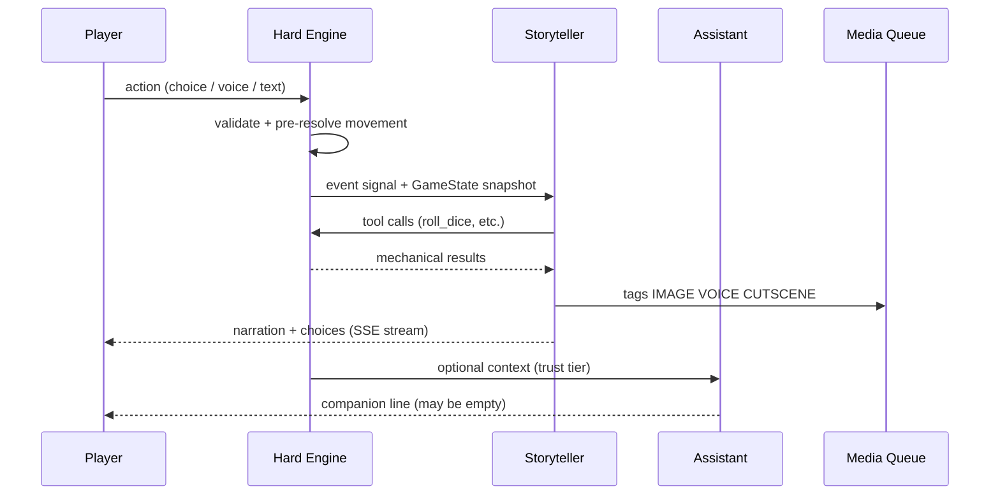
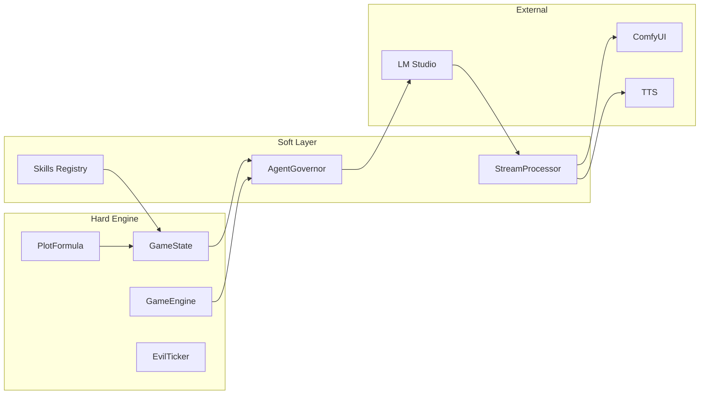

# The Clockwork Dark — System Design Document

**Version:** 0.1.3  
**Status:** PR1–PR5 implemented; design review round 2 applied  
**Last updated:** 2026-06-20

---

## Executive Summary

**The Clockwork Dark** is a local-first, AI-driven roleplaying game set on the frontier edge of a dying world. The player wakes in a forest beside **Edgewood**, the last comfortable village before the deep woods give way to the Marches and, further in, the Heartlands — where something called the **Clockwork Dark** is winding itself into the bones of civilization.

Unlike scripted RPGs, every scene is narrated in real time by autonomous local LLM agents. Unlike pure AI chat games, **mechanical truth lives in a deterministic engine**: dice land where the engine says they land, inventory changes only through validated tool calls, and the world's evil clock advances whether the player becomes a baker or a hero.

The game merges two proven architectures:

- **[Archives of Anubis](https://github.com/nihilistau/Achieves-Of-Anubis)** — hybrid hard engine + narrative council, RAG lore as source of truth, curse-phase escalation, speculative narrative decoding, ComfyUI/TTS integration.
- **[CosySim](https://github.com/nihilistau/CosySim)** — `AgentGovernor`, `@skill` decorator tools, SSE `StreamProcessor` tag injection, dual-agent scene pattern (`realm`), `WorldSim` background ticks, interceptor pipeline.

**Design pillars:**

| Pillar | Meaning |
|--------|---------|
| **Local-first** | LM Studio, ComfyUI, Piper/Qwen TTS, Whisper STT — no cloud dependency for core play |
| **Engine is truth** | LLMs narrate; they do not adjudicate mechanics |
| **Agents have agency** | Storyteller and Assistant choose when to help, hinder, or stay silent |
| **Player freedom is real** | Quiet life is a valid complete experience; the main plot does not require the player |

---

## Glossary

| Term | Definition |
|------|------------|
| **EvilTicker** | Background system that advances `evil_progress` and `evil_phase` on world ticks |
| **Awareness** | Hidden player stat (0–100) gating rumor quality, cutscenes, and spoiler filters |
| **plot_involvement** | Engine-tracked measure of how entangled the player is in the main story (0–100) |
| **story_pressure** | Storyteller-internal meter; rises with plot_involvement; unlocks harder events |
| **Storyteller** | GM agent (`clockwork_storyteller`) — narrates world, runs NPCs, tunes difficulty |
| **Assistant** | Companion agent (`clockwork_assistant`) — speaks to player; may help or withhold |
| **Hard Engine** | Deterministic Python game logic — sole authority on stats, dice, inventory, travel |
| **Soft Layer** | LLM agents, interceptors, media queue — probabilistic presentation |
| **Skill** | `@skill`-decorated function the LLM must call for mechanical resolution |
| **Tag** | Inline stream token (`[IMAGE:…]`, `[STAT:…]`, etc.) parsed from LLM output |

**Evil phases (canonical):** `DORMANT` → `STIRRING` → `SPREADING` → `CONSUMING`

**Core location IDs:** `forest_clearing`, `edgewood_square`, `edgewood_bakery`, `tinker_caravan`, `millhaven_gate`

---

## World & Story Bible

### Setting: The Edgewood Margin

The known world is arranged in concentric rings of civilization and danger:

```
[Deep Forest] → [Edgewood Village] → [The Marches] → [Heartlands] → [The Wound]
     ↑                ↑                    ↑               ↑
  Player start    Quiet life arc      Whisper arc     Convergence arc
```

**Edgewood** is a scrappy frontier village: timber frames, a communal oven, a shrine to old saints nobody can name, and a road that traders use twice a season. Beyond the tree line, the forest is generous but not tame — mushrooms, game, herbs, and things that watch without moving.

**The Marches** are market towns, militia garrisons, toll roads. **The Heartlands** were once the seat of kingdoms. Now refugees speak of crops rotting in patterns, clocks running backward, and men who walk with tick-tick breath.

### Tone & Influences

| Source | What we take |
|--------|--------------|
| *The Name of the Wind* | Tinkers, oral lore, sympathy/naming as costly magic, mundane craft as dignity |
| *Dragonlance* | Mounting evil the world tries to ignore; reluctant involvement; companions with their own agendas |
| Archives of Anubis | Phase-based dread escalation; evaluator quality gate; echo of past runs |
| CosySim realm/tavern | Dual-agent banter; dice economy; living world ticks |

**Magic is grounded.** There are no fireball buttons. Magic costs Focus, material, and often a price in blood or memory. Naming something correctly matters more than shouting a spell name. The Clockwork Dark is not "a demon" — it is a **pattern** that converts living order into ticking, hungry mechanism.

### The Clockwork Dark (Antagonist)

The evil is a **metastasizing logic**: gears in wheat, brass filaments in nerves, militias that march in perfect time until they march into the sea. It does not announce itself in Edgewood. It **stains** the world inward.

The **EvilTicker** runs continuously:

| Phase | Progress | World signs (player may miss) | Agent behavior |
|-------|----------|-------------------------------|----------------|
| **DORMANT** | 0.0–0.2 | Odd dreams, one broken clock | Storyteller: pastoral; Assistant: absent or fleeting |
| **STIRRING** | 0.2–0.5 | Livestock stillborn with brass teeth; tinkers sell "ward charms" | Traders whisper; Assistant may appear as cat |
| **SPREADING** | 0.5–0.8 | Refugees, militia drafts, sympathy sickness | Forced world events rise; cutscenes unlock |
| **CONSUMING** | 0.8–1.0 | Heartlands lost; the pattern hunts names | Both agents intervene strongly |

`evil_progress` advances every world tick by a base rate modified by player inaction (slow) or proximity to Heartlands (fast). **The player is never required to stop it.**

### Story Arcs (Awareness-Gated)

| Arc | Trigger | Player experience |
|-----|---------|-------------------|
| **Quiet Life** | Default | Forest, bakery apprenticeship, festivals; Awareness stays <15 |
| **Whisper** | Trader arrival + 10 days | Maps sold, songs with wrong lyrics, child draws gears |
| **March** | Travel to Millhaven OR Awareness ≥25 | Militia, tolls, burned farmstead quests |
| **Convergence** | Awareness ≥50 OR evil_phase ≥ SPREADING | Name the wound, choose sacrifice, world-scale choices |

Each arc is **valid**. The game never punishes the baker for baking.

### Key NPCs (Seed Roster)

| ID | Name | Role |
|----|------|------|
| `npc_maris` | Maris Hearth | Baker; quest hub for domestic arcs |
| `npc_odran` | Odran Cartwright | Caravan master; brings outward goods, inward rumors |
| `npc_ilya` | Ilya of the Nine Pins | Tinker; sells knowledge maps, sympathy charms |
| `npc_sera` | Sergeant Sera Venn | Millhaven militia; moral ambiguity |
| `npc_brindle` | Brindle | Cat that is sometimes the Assistant |

### The Assistant (Lore)

The Assistant is **not** a UI tutorial. It is an entity (or entities) that the Storyteller also cannot fully control. In Edgewood folklore they are the **Grey Wanderer**, the **Cat Who Knows**, the **Tinker’s Shadow**. They may:

- Offer a true hint disguised as nonsense
- Withhold help to test the player
- Appear in a form suited to trust level and plot_involvement
- Contradict the Storyteller (rare; high drama)

Agency parameters live in engine state and drift over sessions.

---

## The Two Agents

### Storyteller (`clockwork_storyteller`)

**Role:** Game Master, narrator, NPC chorus, difficulty tuner.

**Inherited from:**
- Anubis: Director + Proposer draft loop, Evaluator retry, RAG lore injection, curse-phase tone
- CosySim: `realm_director` JSON response contract, `AgentGovernor`, governance context

**Capabilities:**
- Describe scenes, voice NPCs, present 2–4 choices
- Request skill checks and combat via **required tools** (cannot fabricate outcomes)
- Adjust `story_pressure` — spawn harder encounters, grant mercy, trigger cutscenes
- Query full evil state via `query_evil_state` (player never sees raw numbers)

**Agency knobs** (stored in `GameState.storyteller_mind`):

```python
intervention_willingness: float  # 0-1: likelihood of forcing plot events
cruelty_bias: float              # 0-1: harsher consequences on failure
reward_generosity: float         # 0-1: loot, rep, mercy
patience: float                  # 0-100: low → more aggressive world events
```

**Output contract** (end every turn with JSON block):

```json
{
  "narration": "Second-person prose…",
  "choices": [{"id": "a", "text": "…"}],
  "npc_voices": [{"npc_id": "npc_maris", "line": "…"}],
  "stat_changes": {},
  "items_gained": [],
  "items_lost": [],
  "skill_check": null,
  "tags_inline": "[IMAGE:edgewood_square_dawn]"
}
```

Mechanical changes in JSON are **requests** — the engine applies only validated deltas after tool resolution.

**Quality gate:** Lightweight Evaluator (Anubis pattern) scores tone, lore fit, length. If score < 0.6, one retry with feedback.

### Assistant (`clockwork_assistant`)

**Role:** Player-facing companion; voice/text channel; optional STT listener.

**Reframed from** CosySim `realm_assistant` — **no fourth-wall**. The Assistant exists *in-world* as ambiguous folklore made real.

**Capabilities:**
- Short replies (1–3 sentences) via speech bubble UI
- `grant_hint`, `reveal_lore`, `change_form` as optional skills
- Push-to-talk STT → Assistant processes intent, may relay to Storyteller
- Emit `[VOICE:whisper]` / `[VOICE:urgent]` for TTS styling

**Agency knobs** (`GameState.assistant_mind`):

```python
trust_level: float           # 0-100: rises with player kindness, honesty
help_probability: float      # 0-1: roll each request for help
current_form: str            # cat | wanderer | child | tinker | reflection
appearance_schedule: str       # hidden | rare | common | desperate
```

**Information asymmetry:** Assistant never receives full `evil_progress`. It receives `hint_tier` derived from trust and plot_involvement — preserves mystery.

### Agent Interaction



Both agents share the **CosySim interceptor pipeline** but use different model profiles and skill manifests.

---

## Player Experience Loop

```
1. SESSION START
   └─ ProcGen seed → forest_clearing → character creation (archetype, name)

2. TURN LOOP
   ├─ Player selects choice / free text / voice
   ├─ Engine: validate action, apply movement/craft/trade preconditions
   ├─ Storyteller turn:
   │    ├─ PRE interceptors inject lore, evil tone, state
   │    ├─ LLM streams narration (speculative draft → refine)
   │    ├─ REQUIRED tools resolve checks/combat
   │    ├─ POST interceptors: TTS, ComfyUI queue, stat tags
   │    └─ Evaluator quality gate
   ├─ Assistant turn (probability roll):
   │    └─ May speak, change form, grant hint — or stay silent
   ├─ World tick (if interval elapsed):
   │    ├─ EvilTicker.advance()
   │    ├─ Trader/tinker schedule roll
   │    └─ Storyteller may react (agency roll)
   └─ Persist save

3. MILESTONE EVENTS
   └─ evil phase shift, Awareness threshold, location first-visit
       → CUTSCENE tag → ComfyUI video → letterbox UI + captioned TTS
```

---

## Game Mechanics (Hard Engine)

All mechanics live in `engine/game/`. Agents access them **only** through `@skill` tools with `TRIGGER_REQUIRED` where enforcement matters.

### Player Stats

| Stat | Range | Notes |
|------|-------|-------|
| **HP** | 0–max | Injury, combat |
| **Stamina** | 0–100 | Travel, labor, combat rounds |
| **Focus** | 0–max | Sympathy, naming, craft precision |
| **Reputation** | per-faction | Edgewood, merchants, militia |
| **Craft** | 0–100 | Baking, herbalism, tinker repair |
| **Awareness** | 0–100 | **Hidden** until ≥20 (then "something feels wrong") |

### Dice & Skill Checks

- Standard: `d20 + modifier vs DC`
- Natural 1: complication (engine table, not LLM invention)
- Natural 20: boon (engine table)
- All rolls: `roll_dice(sides=20, modifier=int, reason=str) -> DiceResult`
- Skill taxonomy: `persuasion`, `stealth`, `sympathy`, `lore`, `craft`, `survival`, `nerve`

### Combat (Grounded) — *v0.2*

- Turn-based actions: `attack`, `defend`, `flee`, `use_item`, `sympathy`
- Fear and exhaustion modify rolls
- Resolution via `resolve_combat(action, target_id) -> CombatResult` (PR13+)
- **Not required for v0.1 vertical slice**

### Crafting & Professions — *v0.2*

Recipes in `data/recipes/*.yaml`. Baker/trade via `trade` skill in v0.1; full `craft_item(recipe_id)` deferred to PR13+.

### Inventory schema (v0.1)

```python
{id: str, name: str, qty: int, tags: list[str]}
```

Stored as `InventoryItem` in `GameState.inventory`.

### Economy & Trade

- Each location has supply/demand tables
- `trade(action, item_id, npc_id)` — prices from engine, not narration
- Caravan events inject rare goods and rumor packets

### Travel

Location graph (not grid). Each edge has `travel_time_hours`, `danger_dc`, `awareness_delta`.

```
forest_clearing ──1h── edgewood_square ──4h── millhaven_gate
         │                    ├── edgewood_bakery (0h)
         │                    └── tinker_caravan (0h, event-gated)
```

Each edge carries `hours`, `danger_dc`, `awareness_delta`. Locations carry `evil_multiplier` (forest 0.5, Edgewood 0.8, Millhaven 1.2).

`move_to(location_id)` validates stamina, applies travel time, rolls encounter table.

### Awareness System

Awareness rises from:

| Source | Delta |
|--------|-------|
| Hear rumor (verified) | +3 to +8 |
| Witness anomaly event | +5 |
| Travel inward | +2 per ring |
| Assistant hint (true) | +2 |
| Ignore 3 consecutive anomaly hooks | -1 (denial) |

Gates:

- **Rumor quality:** low Awareness → vague unease; high → names, places, dates
- **Cutscenes:** `[CUTSCENE:…]` only if Awareness ≥ threshold
- **Assistant forms:** `reflection` form locked until Awareness ≥40

### EvilTicker

```python
# Units: evil_progress is dimensionless 0.0–1.0
# evil_base_rate_per_day from config (default 0.01 per in-game day)

evil_progress += evil_base_rate_per_day * days_elapsed * location.evil_multiplier * inaction_bonus
evil_phase = phase_from_progress(evil_progress)  # [0,0.2) DORMANT, [0.2,0.5) STIRRING, ...

plot_involvement = PlotFormula.compute(state)      # engine/game/plot.py
story_pressure = PlotFormula.update_story_pressure(state)  # on GameState
```

`GameState` fields: `evil_progress`, `evil_phase`, `plot_involvement`, `story_pressure`, `awareness`, `procgen: ProcgenResult`.

Storyteller receives full snapshot via `query_evil_state`; player UI shows only diegetic signs.

---

## Procgen World

### Edgewood Village (seeded)

- 12 buildings, 8 NPCs, 1 festival per season
- Bakery job available day 3 if player lingers
- Shrine with incomplete mural (lore hook)

### Forest (seeded)

- 6 forage nodes, 2 hidden paths, 1 optional barrow dungeon
- Encounters weighted by evil_phase

### Trader & Tinker Schedule

| Event | Probability / tick | Effect |
|-------|-------------------|--------|
| `caravan_arrival` | 8% per day after day 5 | Odran + goods + rumor packet |
| `tinker_camp` | 5% per week | Ilya + knowledge trade |
| `militia_press` | only if Awareness ≥20 | recruitment NPC visit |

Templates in `data/procgen_templates/`.

---

## Media & Presentation

### Visual

| Asset type | Source | Trigger |
|------------|--------|---------|
| Location still | ComfyUI SDXL | `[IMAGE:location_id_mood]` |
| NPC portrait | ComfyUI + IPAdapter | first meeting |
| Item icon | ComfyUI small | inventory add |
| Cutscene video | ComfyUI AnimateDiff | `[CUTSCENE:milestone_id]` |

Cache by `(location_id, time_of_day, evil_phase)` hash. `CutsceneBudgetInterceptor` (PR9) enforces phase-shift-only video budget.

### Audio

| Channel | Engine |
|---------|--------|
| Storyteller narration | Piper or Qwen TTS (`:8600`) |
| NPC lines | per-NPC voice profile in `config/voices.yaml` |
| Assistant | form-dependent voice |
| Player input | Whisper STT (`:5051`) |

### UI Layout

```
┌─────────────────────────────────────────────────────────────┐
│  [Location visual — ComfyUI still or cutscene letterbox]    │
├──────────────┬──────────────────────────────┬───────────────┤
│  Assistant   │  Narrative log (SSE stream)    │  Stats sheet  │
│  bubble      │  Choice chips / text input     │  Inventory    │
│              │  Dice toast overlay            │  Reputation   │
├──────────────┴──────────────────────────────┴───────────────┤
│  [Mic]  [Send]  World day · Time · Weather (diegetic)       │
└─────────────────────────────────────────────────────────────┘
```

---

## Technical Architecture

### Stack

| Layer | Choice | Rationale |
|-------|--------|-----------|
| Runtime | Python 3.13 | Matches both parent repos |
| Scene server | Flask + Socket.IO (`FlaskScene` pattern) | CosySim skills/MCP/interceptors |
| Inference | LM Studio `:1234` SSE | Local-first |
| Speculative | `draft` model 0.5B–1B → `big` 8B refine | Anubis + CosySim profiles |
| Lore | Local vector JSON default; Nexus KMS optional | Progressive enhancement |
| Media | ComfyUI `:8188` | Shared with both repos |
| Persistence | JSON saves + SQLite lore | Simple, inspectable |

### Directory Layout

See [CLAUDE_CODE_BRIEF.md](CLAUDE_CODE_BRIEF.md) for full scaffold.

### Data Flow



### Anti-Hallucination Rules

1. **No mechanical prose without tool receipt** — Evaluator rejects narration claiming "you rolled 18" unless `DiceResult` exists in context.
2. **SceneRulesEngine** rejects stat changes not backed by tool calls.
3. **RAG lore** is canonical for world facts; contradictions trigger retry.
4. **AwarenessGate interceptor** strips spoilers below threshold.

### Inference Pipeline

```
1. Speculative pass (draft model, ~50ms skeleton)
2. Stream refine (big model, SSE to UI)
3. StreamProcessor extracts tags during stream
4. REQUIRED skills dispatched before JSON epilogue merge
5. Evaluator scores final packaged turn
```

---

## Key Decisions

| # | Decision | Rationale |
|---|----------|-----------|
| 1 | **New repo** `clockwork-dark/` | Avoid CosySim cyberpunk coupling and Anubis dungeon grid assumptions |
| 2 | **Engine-authoritative mechanics** | Prevents LLM cheating; enables fair replay |
| 3 | **Dual agents** (not 5-agent council) | Intimacy + lower latency on 12GB VRAM; Evaluator retained |
| 4 | **CosySim `@skill` over raw AgentScope** | Decorator ergonomics, cooldowns, MCP alignment, proven interceptors |
| 5 | **FlaskScene over FastAPI-only** | Matches CosySim scene catalog; faster port of realm/tavern patterns |
| 6 | **Awareness as hidden stat** | Preserves "clock unknown" fantasy for quiet-life players |
| 7 | **Optional Nexus KMS** | Local vector store sufficient for v0.1; Nexus as upgrade |
| 8 | **Echo system deferred to v0.2** | Anubis-style past-run ghosts; permadeath TBD |
| 9 | **Video cutscenes milestone-only** | GPU budget control — max 1 video per 30 min session default |
| 10 | **Assistant in-world** | Raistlin/Gandalf tone requires removing fourth-wall meta humor |
| 11 | **JSON save v1, no migration** | `save_version: 1` on GameState; breaking changes bump version |
| 12 | **Speculative decode optional** | Falls back to single-model stream if draft model unavailable |
| 13 | **JSON parse failure** | Retry once with repair prompt; then template fallback choices |

### Implementation decisions (v0.1)

| Topic | Decision |
|-------|----------|
| Save format | JSON in `data/saves/` with `save_version` |
| FlaskScene | Ported in PR10; PR1 ships `launcher.py` stub |
| PR3 enforcement | `SceneRulesEngine` rules R001–R005; Evaluator prose check in PR5 |
| PR5 lore | Stub empty RAG until PR11; LoreInject no-op if DB empty |
| PR6 minimum | PR4 + GameState injection (can parallel partial UI before PR5) |

---

## Skills & Tags Manifest

Canonical list — implementation in `engine/skills/builtin/mechanics.py`.

| Skill | Trigger | Agent | PR |
|-------|---------|-------|-----|
| `roll_dice` | required | Storyteller | 3 ✅ |
| `resolve_skill_check` | required | Storyteller | 3 ✅ |
| `move_to` | required | Storyteller | 3 ✅ |
| `query_evil_state` | required | Storyteller | 3 ✅ |
| `trade` | optional | Storyteller | 3 ✅ |
| `advance_world_tick` | auto | system | 3 ✅ |
| `grant_hint` | optional | Assistant | 6 |
| `reveal_lore` | optional | Assistant | 6 |
| `change_form` | optional | Assistant | 6 |

| Tag | Effect | PR |
|-----|--------|-----|
| `[IMAGE:prompt]` | ComfyUI still | 9 |
| `[CUTSCENE:id]` | Video cutscene | 9 |
| `[VOICE:style]` | TTS style | 9 |
| `[STAT:name±val]` | Stat delta (requires tool receipt) | 5 |
| `[ACTION:x]` | Game event | 5 |
| `[MOOD:x]` | Tone metadata | 5 |

---

## PR Plan

Incremental pull requests with t-shirt sizes. ✅ = complete.

### PR1 — Repository Scaffold ✅ (S)
- **Files:** `pyproject.toml`, `requirements.txt`, `pytest.ini`, `config/default.yaml`, `engine/config.py`, `launcher.py`, `scripts/start.ps1`, `tests/conftest.py`
- **Dependencies:** none
- **Done when:** `pytest` runs; `python launcher.py --help` works

### PR2 — GameState + EvilTicker ✅ (M)
- **Files:** `engine/game/state.py`, `evil_ticker.py`, `locations.py`, `dice.py`, `plot.py`, `engine.py`, tests
- **Dependencies:** PR1
- **Done when:** serialize round-trip; evil monotonic; phase boundaries tested

### PR3 — Skills + Rules Engine ✅ (M)
- **Files:** `engine/skills/registry.py`, `builtin/mechanics.py`, `engine/mcp/scene_rules_engine.py`, `data/economy.yaml`, `content/scenes/clockwork/clockwork_skills.py`, `test_skill_enforcement.py`
- **Dependencies:** PR2
- **Done when:** SceneRulesEngine R001–R005 tests pass; **not** Evaluator (that's PR5)

### PR4 — LMSClient + StreamProcessor ✅ (L)
- **Files:** `engine/lmstudio/client.py`, `events.py`, `profiles.py`, `speculative.py`, `engine/agents/stream_processor.py`
- **Dependencies:** PR1
- **Done when:** Mock SSE tests pass; `infer_processed()` extracts `[IMAGE:]`, `[CUTSCENE:]`, `[STAT:]`; speculative draft→refine fallback

### PR5 — Storyteller Agent ✅ (L)
- **Files:** `engine/agents/storyteller.py`, `evaluator.py`, `tool_dispatcher.py`, `prompts.py`
- **Dependencies:** PR3, PR4, **PR11 stub OK**
- **Done when:** JSON parse, tool_calls execution, Evaluator retry on hallucinated mechanics, mock LLM tests pass

### PR6 — Assistant Agent ✅ (M)
- **Files:** `engine/agents/assistant.py`, `engine/skills/builtin/assistant.py`, `engine/media/stt.py`
- **Dependencies:** PR4 minimum; full integration PR5
- **Done when:** Agency silent/help branches, form system, grant_hint/reveal_lore/change_form skills, STT stub, mock LLM tests pass

### PR7 — ProcGen Edgewood ✅ (M)
- **Files:** `engine/game/procgen.py`, `data/procgen_templates/edgewood.yaml`, extended `ProcgenResult`
- **Dependencies:** PR2
- **Done when:** Same seed yields identical NPCs/buildings/forest; 8 NPCs (5 canon + 3 procedural), 12 buildings, `new_game_state()` helper, tests pass

### PR8 — WorldSim + Traders ✅ (M)
- **Files:** `engine/world/world_sim.py`, `engine/world/schedules.py`, `data/world/schedules.yaml`
- **Dependencies:** PR2, PR7
- **Done when:** `WorldSim.on_tick` advances evil + schedules; forced `caravan_arrival` stores rumor/event; militia gated by awareness; tests pass

### PR9 — Media Pipeline ✅ (L)
- **Files:** `engine/media/comfyui.py`, `tts.py`, `cutscene.py`, `pipeline.py`, `interceptors.py`, `data/procgen_templates/comfyui.yaml`
- **Dependencies:** PR4
- **Done when:** ComfyUI queue receives image jobs (mock/placeholder), TTS text fallback, cutscene phase-shift budget, Storyteller turn emits `media` dict, tests pass

### PR10 — Frontend Scene ✅ (L)
- **Files:** `content/scenes/clockwork/*`, `engine/scenes/flask_scene.py`, `launcher.py`
- **Dependencies:** PR5, PR6, PR7, PR8, PR9
- **Done when:** Browser loads `:5573`; REST + Socket.IO `player_choice` emits `turn_update`; health/new/choice/state routes work; tests pass

### PR11 — RAG Lore Seed ✅ (M)
- **Files:** `engine/lore/manager.py`, `engine/lore/interceptors.py`, `scripts/seed_lore.py`, `data/lore/*.md`
- **Dependencies:** PR1
- **Done when:** `seed_lore.py` ingests markdown; FTS retrieval returns chunks; LoreInject + AwarenessGate wired to Storyteller; tests pass

### PR12 — Vertical Slice Playtest (S)
- **Dependencies:** PR1–PR11 (PR7+PR8 required for baker/caravan acceptance criteria)
- **Description:** `test_vertical_slice.py` end-to-end smoke

---

## Open Questions

| Question | Options | Default for v0.1 |
|----------|---------|------------------|
| Permadeath? | permadeath / respawn at Edgewood / echo ghost | respawn with stamina penalty |
| Video cutscene budget | unlimited / 1 per 30 min / phase shifts only | phase shifts only |
| Multiplayer | defer / async shared world | defer |
| Nexus KMS | required / optional | optional |
| Player character creation depth | archetype only / full point-buy | archetype only |

---

## Related Documents

- **[CLAUDE_DESIGN_BRIEF.md](CLAUDE_DESIGN_BRIEF.md)** — Art direction, UI, ComfyUI prompts for design agents
- **[CLAUDE_CODE_BRIEF.md](CLAUDE_CODE_BRIEF.md)** — Implementation spec for coding agents

---

*End of design document.*